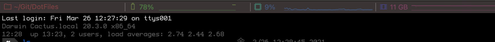
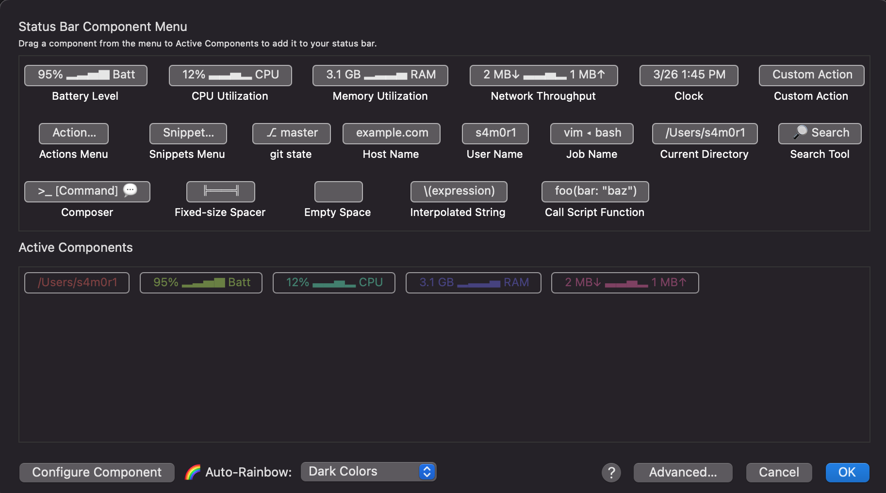

# iTerm2導入時メモ

## 再セットアップ時
- プロファイル設置
- Preference->Profile->OtherAction->importJSON

## 設定エクスポート
プロファイルはエディターなどでいじらない  
iTerm2で設定してからエクスポートのみで対応させる
- 出力するプロファイルを選択
- Preference->Profle->OtherAction->SaveProfileJSON
- DOTFILES/iTerm2/profileに保存
- gitでPush

## ステータスバー
これ  

いつもの設定
  
